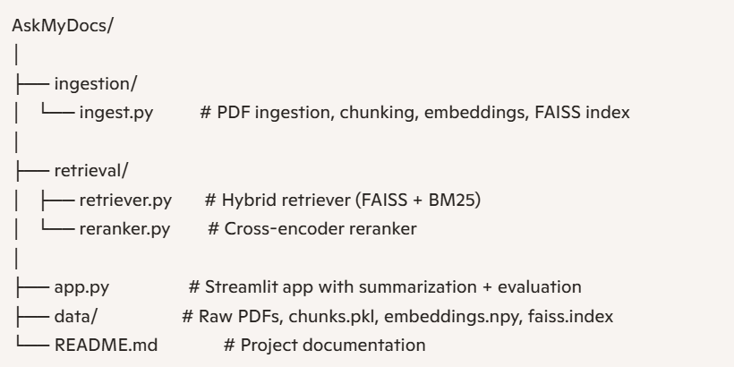

# RAG Chatbot - Ask My Docs

## 📌 Overview
Ask My Docs is a **Proof of Concept (POC)** for a Retrieval-Augmented Generation (RAG) chatbot.  
It demonstrates an end-to-end pipeline that ingests documents, retrieves relevant chunks, reranks them, evaluates grounding, and generates recruiter‑ready summarized answers — all optimized for **CPU-only local execution**.

---

## 🚀 Features
- **Document ingestion**: PDFs are loaded, chunked, and embedded with SentenceTransformers.
- **Hybrid retrieval**: FAISS vector search + BM25 keyword search for balanced recall.
- **Reranking**: Cross-encoder reranker improves relevance of retrieved chunks.
- **Faithfulness scoring**: Integrated with [RAGAS](https://github.com/explodinggradients/ragas) to measure grounding.
- **Summarization**: Uses OpenAI API (`gpt-4o-mini`) to produce structured, concise answers.
- **Citation enforcement**: Each answer cites its source filenames.
- **Transparency**: UI shows both summarized answers and raw chunks with scores.
- **CPU optimization**: No GPU dependencies; runs locally on standard hardware.

---

## 🛠️ Tech Stack
- **Python 3.10+**
- **Streamlit** (UI)
- **pdfplumber** (PDF ingestion)
- **LangChain text splitters**
- **SentenceTransformers** (embeddings)
- **FAISS** (vector search)
- **BM25** (keyword search)
- **RAGAS** (faithfulness evaluation)
- **OpenAI API** (summarization)

---

## 📂 Project Structure



## ⚙️ Setup & Installation
1. Clone the repo:
   ```bash
   git clone https://github.com/your-repo/ask-my-docs.git
   cd ask-my-docs

2. Create environment & install dependencies:
    conda create -n rag_app python=3.10
    conda activate rag_app
    pip install -r requirements.txt

3. Set your OpenAI API key:
    export OPENAI_API_KEY="your_key_here"


## ✅ POC Targets Achieved

-Hybrid retrieval (FAISS + BM25)
-Reranking with cross-encoder
-Faithfulness scoring (RAGAS)
-Summarization with OpenAI API
-Citation enforcement

## 📊 Evaluation & Metrics
This POC integrates [RAGAS](https://github.com/explodinggradients/ragas) to compute **faithfulness scores** for each answer.  
- Faithfulness measures whether the generated answer is grounded in retrieved context.  
- Target threshold: ≥0.80 average faithfulness across queries.  
- Current implementation computes per‑answer scores; future work will add batch evaluation in CI/CD.

## 📸 Demo Screenshot

Here’s how the app looks when running locally:


## ⚠️ Limitations
- Only supports locally ingested PDFs.  
- Summarization requires OpenAI API access.  
- No semantic filtering of irrelevant chunks yet.  
- UI is basic Streamlit; production would need polish.

## 🔮 Future Work
- Add semantic filtering before summarization.  
- Domain‑aware prompts for financial vs policy queries.  
- Batch evaluation pipeline for CI/CD.  
- Enhanced UI with tabs/collapsible sections.

## 🙏 Acknowledgements
Built using:
- [SentenceTransformers](https://www.sbert.net/)  
- [FAISS](https://github.com/facebookresearch/faiss)  
- [RAGAS](https://github.com/explodinggradients/ragas)  
- [Streamlit](https://streamlit.io/)  
- [pdfplumber](https://github.com/jsvine/pdfplumber)  
- [LangChain](https://www.langchain.com/)

---


---

## 📌 Conclusion
This project successfully demonstrates a **CPU‑optimized Retrieval‑Augmented Generation (RAG) pipeline** with:
- Hybrid retrieval (FAISS + BM25)
- Reranking for relevance
- Faithfulness evaluation with RAGAS
- Summarization via OpenAI API
- Citation enforcement
- Transparent dual‑view outputs (summarized + raw chunks)

It meets all the original POC targets and serves as a **flagship demo** showcasing end‑to‑end RAG capabilities with cost discipline and recruiter‑ready presentation.

Future enhancements could include semantic filtering, domain‑aware prompts, batch evaluation in CI/CD, and UI polish — but the current version already achieves the intended proof‑of‑concept goals.

---

## 👤 Author
**Niranjan Joshi**  
Transitioning into GenAI/AI Engineering with hands‑on POCs and hackathon projects.


This README captures your **POC scope, achievements, and usage instructions**   

Do you want me to also generate a **requirements.txt** file so anyone cloning the repo can set it up instantly?
